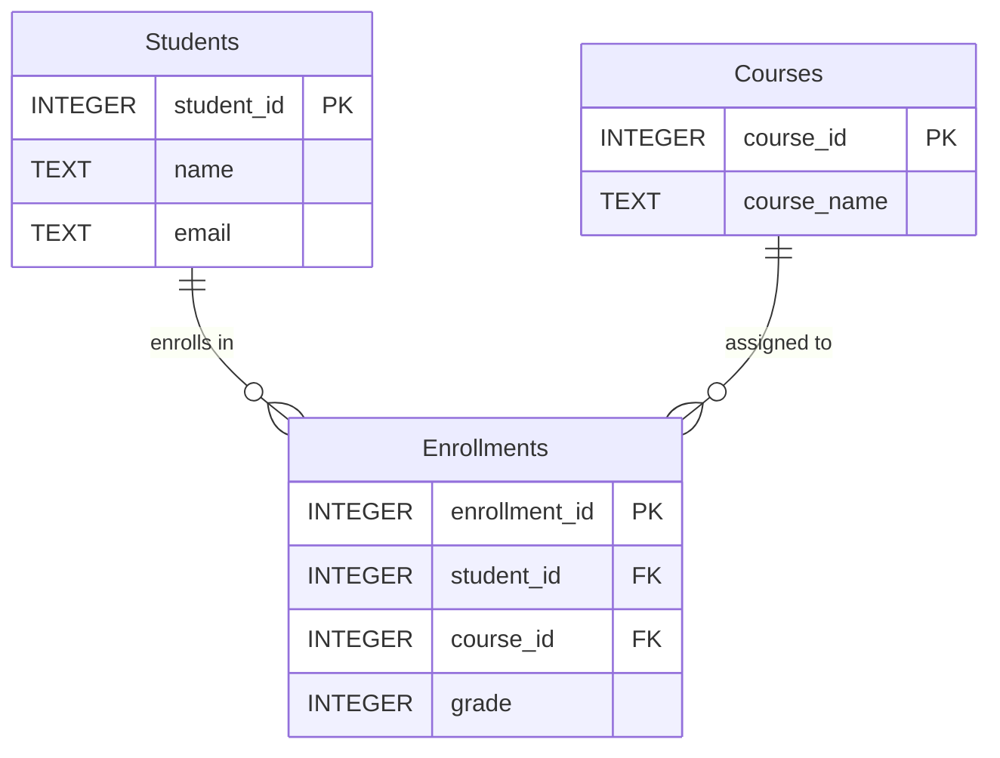

# Student Management System — Database Programming Assignment

## Business Problem

Academic institutions need a reliable way to track student enrolments and academic performance across multiple courses. Without a structured database, it becomes difficult to:

- Monitor individual student grades and overall performance
- Identify which courses are the most and least challenging
- Rank students and compare performance against class averages
- Generate reports for academic advisors and administrators

This project implements a **Student Management System** using SQLite. It models students, courses, and their enrolment relationships, then uses advanced SQL techniques — Common Table Expressions (CTEs) and Window Functions — to extract meaningful insights from the data.

---

## Database Schema

The system consists of three tables:

**`Students`** — stores student identity information.

| Column | Type | Constraint |
|---|---|---|
| `student_id` | INTEGER | PRIMARY KEY |
| `name` | TEXT | NOT NULL |
| `email` | TEXT | — |

**`Courses`** — stores available course offerings.

| Column | Type | Constraint |
|---|---|---|
| `course_id` | INTEGER | PRIMARY KEY |
| `course_name` | TEXT | — |

**`Enrollments`** — junction table linking students to courses, with grade recorded.

| Column | Type | Constraint |
|---|---|---|
| `enrollment_id` | INTEGER | PRIMARY KEY |
| `student_id` | INTEGER | FOREIGN KEY → Students |
| `course_id` | INTEGER | FOREIGN KEY → Courses |
| `grade` | INTEGER | — |

```sql
CREATE TABLE Students (
    student_id INTEGER PRIMARY KEY,
    name TEXT NOT NULL,
    email TEXT
);

CREATE TABLE Courses (
    course_id INTEGER PRIMARY KEY,
    course_name TEXT
);

CREATE TABLE Enrollments (
    enrollment_id INTEGER PRIMARY KEY,
    student_id INTEGER,
    course_id INTEGER,
    grade INTEGER,
    FOREIGN KEY(student_id) REFERENCES Students(student_id),
    FOREIGN KEY(course_id) REFERENCES Courses(course_id)
);
```

---

## ER Diagram

The diagram below uses Chen (classic) notation: rectangles = entities, ovals = attributes, double ovals = primary keys, diamonds = relationships, and 1/N labels = cardinality.



**Relationships:**
- One `Student` can have zero or many `Enrollments` (1 to N)
- One `Course` can appear in zero or many `Enrollments` (1 to N)
- `Enrollments` is the junction table that resolves the many-to-many relationship between Students and Courses

---

## CTE Examples

Common Table Expressions (CTEs) make complex queries more readable by breaking them into named, reusable sub-queries defined with `WITH`.

### 1. Simple CTE — Average grade per student

```sql
WITH StudentAverage AS (
    SELECT
        student_id,
        AVG(grade) AS average_grade
    FROM Enrollments
    GROUP BY student_id
)
SELECT
    s.student_id,
    s.name,
    sa.average_grade
FROM StudentAverage sa
JOIN Students s ON sa.student_id = s.student_id
ORDER BY s.student_id;
```

**Sample output (first 5 rows):**

| student_id | name | average_grade |
|---|---|---|
| 1 | Alice Johnson | 89.5 |
| 2 | Bob Smith | 78.5 |
| 3 | Charlie Brown | 92.0 |
| 4 | Diana Miller | 70.0 |
| 5 | Ethan Davis | 87.0 |

---

### 2. Aggregation CTE — Average grade per course

```sql
WITH CourseAverages AS (
    SELECT
        course_id,
        AVG(grade) AS avg_grade
    FROM Enrollments
    GROUP BY course_id
)
SELECT
    c.course_name,
    ca.avg_grade
FROM CourseAverages ca
JOIN Courses c ON ca.course_id = c.course_id
ORDER BY ca.avg_grade DESC;
```

**Output:**

| course_name | avg_grade |
|---|---|
| Artificial Intelligence | 91.2 |
| Database Systems | 89.5 |
| Computer Networks | 83.6 |
| Web Development | 83.5 |
| Data Structures | 83.0 |
| Software Engineering | 82.5 |
| Introduction to Programming | 79.17 |
| Operating Systems | 77.8 |

---

### 3. CTE + JOIN — All student enrolments with grades

```sql
WITH EnrollmentDetails AS (
    SELECT student_id, course_id, grade
    FROM Enrollments
)
SELECT
    s.name,
    c.course_name,
    ed.grade
FROM EnrollmentDetails ed
JOIN Students s ON ed.student_id = s.student_id
JOIN Courses c  ON ed.course_id  = c.course_id
ORDER BY s.name;
```

**Sample output (first 5 rows):**

| name | course_name | grade |
|---|---|---|
| Alice Johnson | Introduction to Programming | 88 |
| Alice Johnson | Database Systems | 91 |
| Bob Smith | Introduction to Programming | 75 |
| Bob Smith | Data Structures | 82 |
| Charlie Brown | Database Systems | 95 |

---

### 4. Multiple CTEs — Student vs. overall average

```sql
WITH StudentAverage AS (
    SELECT student_id, AVG(grade) AS average_grade
    FROM Enrollments
    GROUP BY student_id
),
OverallAverage AS (
    SELECT AVG(grade) AS overall_average
    FROM Enrollments
)
SELECT
    s.name,
    sa.average_grade,
    oa.overall_average,
    CASE
        WHEN sa.average_grade > oa.overall_average THEN 'Above Average'
        WHEN sa.average_grade < oa.overall_average THEN 'Below Average'
        ELSE 'Average'
    END AS performance
FROM StudentAverage sa
JOIN Students s ON sa.student_id = s.student_id
CROSS JOIN OverallAverage oa
ORDER BY sa.average_grade DESC;
```

**Sample output (top 5):**

| name | average_grade | overall_average | performance |
|---|---|---|---|
| Julia Anderson | 96.0 | 83.85 | Above Average |
| Paula Walker | 94.5 | 83.85 | Above Average |
| Charlie Brown | 92.0 | 83.85 | Above Average |
| Hannah Moore | 90.0 | 83.85 | Above Average |
| Alice Johnson | 89.5 | 83.85 | Above Average |

---

### 5. Recursive CTE — Generate numbers 1 to 10

```sql
WITH RECURSIVE Numbers(n) AS (
    SELECT 1
    UNION ALL
    SELECT n + 1 FROM Numbers WHERE n < 10
)
SELECT * FROM Numbers;
```

**Output:**

| n |
|---|
| 1 |
| 2 |
| 3 |
| ... |
| 10 |

---

## Window Function Examples

Window functions perform calculations across a set of rows related to the current row, without collapsing the result into a single row (unlike `GROUP BY`).

### Ranking Functions

#### `ROW_NUMBER()` — Unique sequential rank by grade

```sql
SELECT
    student_id,
    course_id,
    grade,
    ROW_NUMBER() OVER (ORDER BY grade DESC) AS row_num
FROM Enrollments;
```

| student_id | course_id | grade | row_num |
|---|---|---|---|
| 10 | 8 | 98 | 1 |
| 16 | 8 | 96 | 2 |
| 3 | 2 | 95 | 3 |

---

#### `RANK()` — Rank with gaps for ties

```sql
SELECT
    student_id,
    grade,
    RANK() OVER (ORDER BY grade DESC) AS rank
FROM Enrollments;
```

| student_id | grade | rank |
|---|---|---|
| 10 | 98 | 1 |
| 16 | 96 | 2 |
| 8 | 92 | 6 |
| 20 | 92 | 6 |
| 1 | 91 | 8 |

> Tied grades at 92 both receive rank 6, and the next rank jumps to 8.

---

#### `DENSE_RANK()` — Rank without gaps for ties

```sql
SELECT
    student_id,
    grade,
    DENSE_RANK() OVER (ORDER BY grade DESC) AS dense_rank
FROM Enrollments;
```

| student_id | grade | dense_rank |
|---|---|---|
| 8 | 92 | 6 |
| 20 | 92 | 6 |
| 1 | 91 | 7 |

> Unlike `RANK()`, the next rank after tied 92s is 7 (no gap).

---

#### `PERCENT_RANK()` — Relative position as a percentage

```sql
SELECT
    student_id,
    grade,
    ROUND(PERCENT_RANK() OVER (ORDER BY grade), 2) AS percent_rank
FROM Enrollments;
```

| student_id | grade | percent_rank |
|---|---|---|
| 4 | 67 | 0.0 |
| 10 | 98 | 1.0 |

---

### Aggregate Window Functions

#### `SUM() OVER()` — Running total of grades

```sql
SELECT
    enrollment_id,
    grade,
    SUM(grade) OVER (ORDER BY enrollment_id) AS running_total
FROM Enrollments;
```

| enrollment_id | grade | running_total |
|---|---|---|
| 1 | 88 | 88 |
| 2 | 91 | 179 |
| 3 | 75 | 254 |

---

#### `AVG() OVER()` — Overall average shown on every row

```sql
SELECT
    student_id,
    grade,
    ROUND(AVG(grade) OVER (), 2) AS overall_average
FROM Enrollments;
```

| student_id | grade | overall_average |
|---|---|---|
| 1 | 88 | 83.85 |
| 1 | 91 | 83.85 |

---

#### `MIN() / MAX() OVER(PARTITION BY)` — Per-student lowest and highest grade

```sql
SELECT
    student_id,
    course_id,
    grade,
    MIN(grade) OVER (PARTITION BY student_id) AS lowest_grade,
    MAX(grade) OVER (PARTITION BY student_id) AS highest_grade
FROM Enrollments;
```

| student_id | course_id | grade | lowest_grade | highest_grade |
|---|---|---|---|---|
| 1 | 1 | 88 | 88 | 91 |
| 1 | 2 | 91 | 88 | 91 |
| 3 | 2 | 95 | 89 | 95 |

---

### Navigation Functions

#### `LAG()` and `LEAD()` — Previous and next grade in sequence

```sql
SELECT
    student_id,
    grade,
    LAG(grade)  OVER (ORDER BY grade) AS previous_grade,
    LEAD(grade) OVER (ORDER BY grade) AS next_grade
FROM Enrollments;
```

| student_id | grade | previous_grade | next_grade |
|---|---|---|---|
| 4 | 67 | NULL | 69 |
| 19 | 69 | 67 | 70 |
| 10 | 98 | 96 | NULL |

---

### Distribution Functions

#### `NTILE(4)` — Divide students into quartiles

```sql
SELECT
    student_id,
    grade,
    NTILE(4) OVER (ORDER BY grade DESC) AS quartile
FROM Enrollments;
```

| student_id | grade | quartile |
|---|---|---|
| 10 | 98 | 1 |
| 16 | 96 | 1 |
| 15 | 77 | 4 |
| 4 | 67 | 4 |

---

#### `CUME_DIST()` — Cumulative distribution of grades

```sql
SELECT
    student_id,
    grade,
    ROUND(CUME_DIST() OVER (ORDER BY grade), 2) AS cumulative_distribution
FROM Enrollments;
```

| student_id | grade | cumulative_distribution |
|---|---|---|
| 4 | 67 | 0.03 |
| 9 | 70 | 0.07 |
| 10 | 98 | 1.0 |

---

## Analysis

The dataset consists of **20 students** enrolled across **8 courses**, with each student taking two courses. CTEs were used to calculate student and course averages, making complex queries more readable and easier to manage.

The analysis revealed that the **overall average grade was 83.85**. Exactly 10 students performed above this threshold and 10 performed below it, indicating a balanced distribution of academic performance across the cohort.

At the course level, **Artificial Intelligence** recorded the highest average grade (91.2), making it the strongest-performing course. **Operating Systems** had the lowest average (77.8), suggesting it was comparatively more challenging for students.

Window functions enriched the analysis considerably. Ranking functions (`ROW_NUMBER`, `RANK`, `DENSE_RANK`) provided different perspectives on grade ordering, while distribution functions (`PERCENT_RANK`, `CUME_DIST`, `NTILE`) showed how grades spread across the population. Navigation functions (`LAG`, `LEAD`) made it straightforward to compare each grade against its neighbours in sorted order, and partitioned aggregates (`MIN`, `MAX` with `PARTITION BY`) revealed each student's personal grade range without requiring a separate sub-query.

Overall, the combination of CTEs and window functions demonstrated how advanced SQL features can simplify complex data analysis, improve query readability, and surface meaningful insights into student performance.

---

## References

- SQLite Documentation — Window Functions: https://www.sqlite.org/windowfunctions.html
- SQLite Documentation — WITH clause (CTEs): https://www.sqlite.org/lang_with.html
- W3Schools SQL Window Functions: https://www.w3schools.com/sql/sql_window_functions.asp
- Mode Analytics SQL Tutorial — Window Functions: https://mode.com/sql-tutorial/sql-window-functions/

---